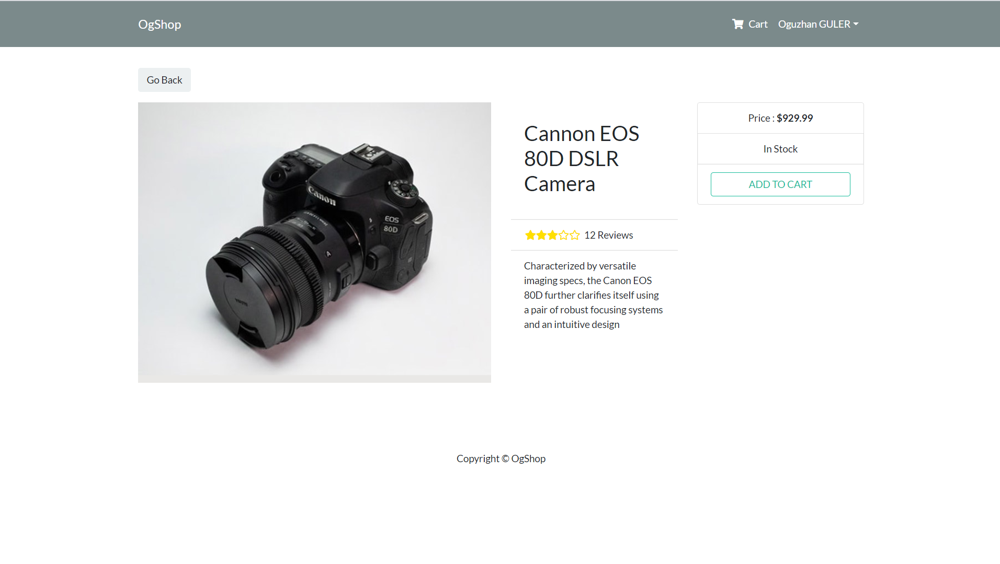
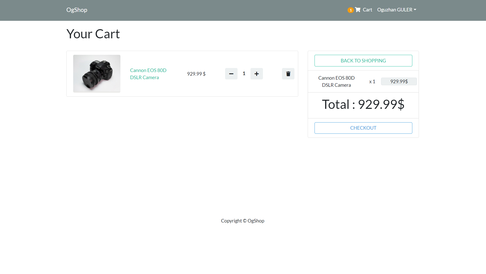
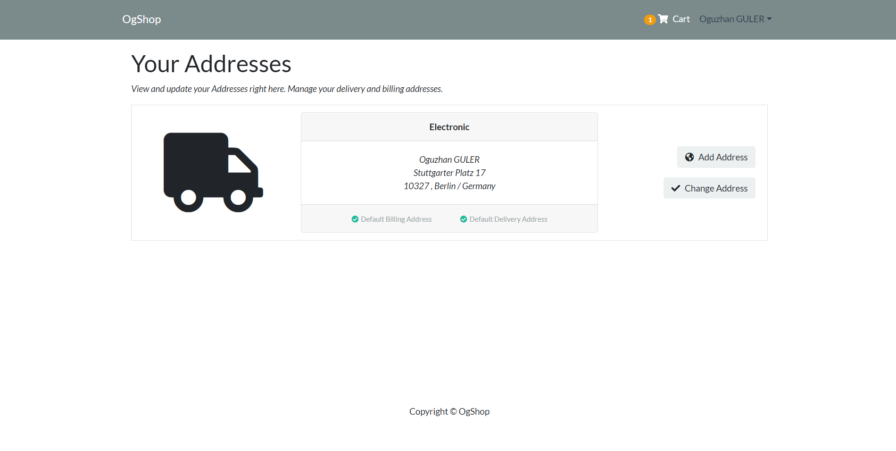
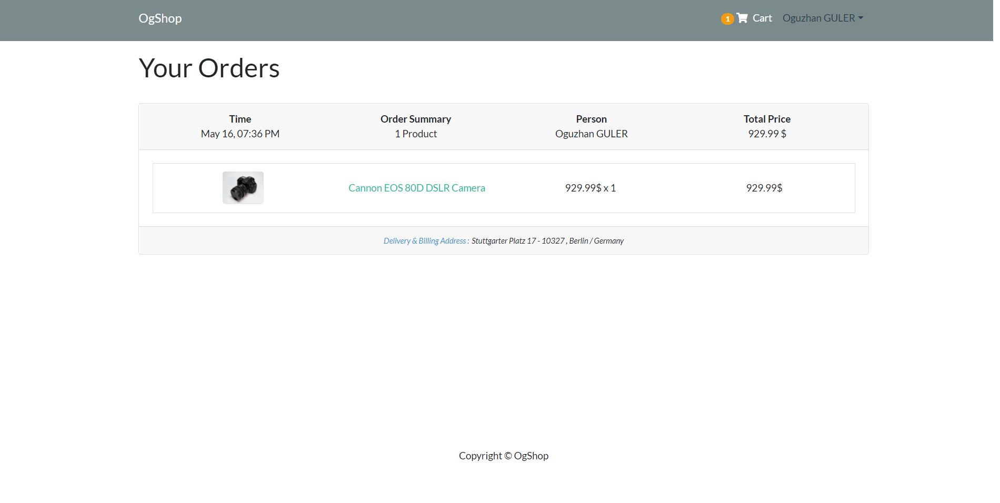

# Shopping App

# E-Commerce App for electronics

## This project was made with with the famous MERN Stack. 
## MongoDb - Express - React - NodeJs
## For the state management : Redux - Toolkit
 
a live demo : [OgShop](https://eshopappogset.herokuapp.com/)
 
## Available Scripts

In the project directory, you can run:

### `npm run dev`

Runs the app in the development mode.\
The page will reload if you make edits.\
You will also see any lint errors in the console.

### `npm run server`

Runs the server with nodemon.
Server will restart if you make edits.\

### `npm run client`

Runs the app in the client mode.

 

 

